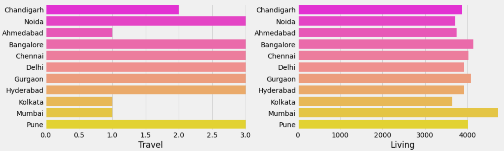
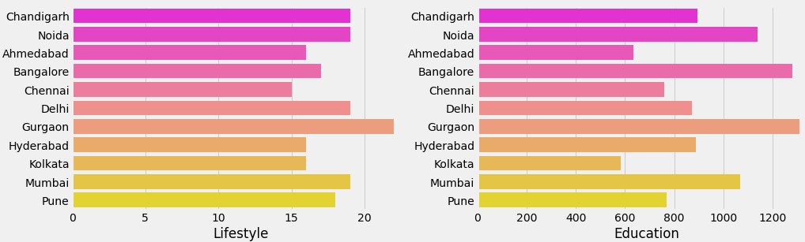
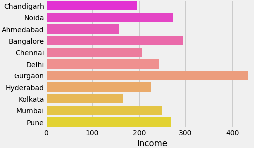

# Cost of Living Analyser
  
In this project I have Analysed for cost of living in different regions.
 
Cost of living is maintaineg a certain standard of living that includes accomodation, food, healthcare, etc.
  
Amount of money needed to survive in different geographical regions.
 
Analysed the most expensive and cheapest places of the world.
   

  

  
There area various parameters based on which the cost of living depends and their correlation plays a very important role in determining if that place in appropriate or not.

Used Nominatim & Rate Limiter from  Geopy library for extracting Latitude and Longitude of all locations.
  
Performed Feature Engineering i.e. creating new Input Features from the existing ones to improve the performance. Aggregated various the common features to create new features.
  
Performed Geospatial Analysis that includes techniques which studied entities using their geographical properties.  
Made a bubble map on the base map using folium to understant various parameters on the map geographically.  
Utilized Heatmap function from seaborn library to understand correlation of factors (using corr function)
  

  
Comparision of Indian Cities based on Travel, Living, Lifestyle, Education and Income.  
  
  
  
